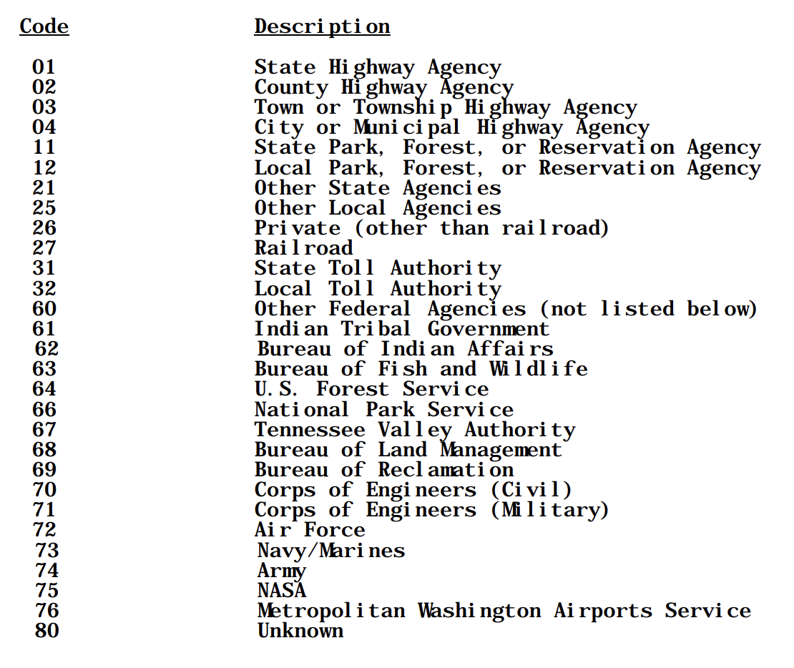

# Gecko <-> HackBeanpot

This repository is for the workshop event with Gecko Robotics and HackBeanpot.

This project was bootstrapped with [Create React App](https://github.com/facebook/create-react-app).

## Prerequisites

1. Download [git](https://git-scm.com/)
2. Download [npm](https://www.npmjs.com/package/npm)

## Running the project

After cloning this repo, in the project directory, start with running 

### `npm install`

to install all of the project dependencies. Then, run

### `npm start`

to start the app in the development mode.
Open [http://localhost:3000](http://localhost:3000) to view it in your browser.

The page will reload when you make changes.

## Using the bridge data

We've pulled National Bridge Inventory data from [this source](https://www.fhwa.dot.gov/bridge/nbi/ascii2023.cfm). In `src/data`, there's `.txt`. files containing CSV data for each state. 

The column names are consistent across each file. [This record format table](https://www.fhwa.dot.gov/bridge/nbi/format.cfm) provides the names of each of the columns, and you can use [this pdf](https://www.fhwa.dot.gov/bridge/mtguide.pdf) to get more information about what each value means. 

In the data, usually each column title is the record format it's referring to transformed to be entirely capitalized and separated by underscores, with a 3-digit representation of the item number appended to the end. For example, the first [record](https://www.fhwa.dot.gov/bridge/nbi/format.cfm) in the table is State Code, which has an item number of 1. The column title for this value is `STATE_CODE_001`. You can look at the data files to see other examples. 

We've provided a way to get and use this data (feel free to add your own function!):

### `useBridgeData`

`useBridgeData` is a custom React hook we've made for you. It takes in a string which should be a two letter state abbreviation of whatever state you'd like to get data for, and returns a list of objects that represent each row in the given state data file. Each object contains an key-value pair for all of the columns in the data. For example:

```
[
    {
        "STATE_CODE_001": "25",
        "STRUCTURE_NUMBER_008": "000053270-00051",
        "RECORD_TYPE_005A": "1",
        "ROUTE_PREFIX_005B": "6",
        "SERVICE_LEVEL_005C": "0",
        "ROUTE_NUMBER_005D": "00000",
        "DIRECTION_005E": "0",
        ... 
    }
]

```

As stated above, this is a custom React hook, meaning that if you dynamically change the inputted state, the returned value will update and return the data for the new given state. An example can be seen in `src/GeckoUseBridgeExample.jsx`. 

If this doesn't fit your use case or you want to pull specific data, try to update the `useBridgeData` function or write your own!

## Potentially Useful Data

Here's some of the fields that could be useful/interesting to you to generate project ideas:
(Descriptions come directly from [this pdf](https://www.fhwa.dot.gov/bridge/mtguide.pdf))

- Latitude/Longitude - items 16 & 17 - `LAT_016` & `LONG_017`

"For bridges on STRAHNET and STRAHNET Connector highways and on the NHS,
record and code the longitude/latitude of each in degrees, minutes and seconds to
the nearest hundredth of a second (with an assumed decimal point). A
leading zero shall be coded where needed. The point of the coordinate
may be the beginning of the bridge in the direction of the inventory or
any other consistent point of reference on the bridge which is
compatible with the LRS. If the bridge is not on a STRAHNET highway or
the NHS, a code of all zeros is acceptable, but it is preferable to code
the longitude if available"

Could be useful for location-based data 

- Bypass/Detour Length - item 19 - `DETOUR_KILOS_019`

"Indicate the actual length to the nearest kilometer of the detour
length. The detour length should represent the total additional travel
for a vehicle which would result from closing of the bridge. The factor
to consider when determining if a bypass is available at the site is the
potential for moving vehicles, including military vehicles, around the
structure. This is particularly true when the structure is in an
interchange. For instance, a bypass likely would be available in the
case of diamond interchanges, interchanges where there are service roads
available, or other interchanges where the positioning and layout of the
ramps is such that they could be used without difficulty to get around
the structure. If a ground level bypass is available at the structure
site for the inventory route, record and code the detour length as 000"

- Owner - item 22 - `OWNER_022`

"The actual name(s) of the owner(s) of the bridge shall be recorded on
the inspection form. The codes used in Item 21 - Maintenance
Responsibility shall be used to represent the type of agency that is the
primary owner of the structure. If more than one agency has equal
ownership, code one agency in the hierarchy of State, Federal, county,
city, railroad, and other private."



- Year Built - item 27 - `YEAR_BUILT_027`

The year the bridge was built 

- Average Daily Traffic - item 29 - `ADT_029`

"Code a 6-digit number that shows the average daily traffic volume for
the inventory route identified in Item 5. Make certain the unit's
position is coded even if estimates of ADT are determined to tens or
hundreds of vehicles; that is, appropriate trailing zeros shall be
coded. The ADT coded should be the most recent ADT counts available.
Included in this item are the trucks referred to in Item 109 - Average
Daily Truck Traffic. If the bridge is closed, code the actual ADT from
before the closure occurred."

These are some examples of what could be interesting/useful data to visualize, but there's plenty more- 123 columns of data in total. There's a lot of different paths you could go down - be creative with it, no idea is impossible. We're here to help you out too!
